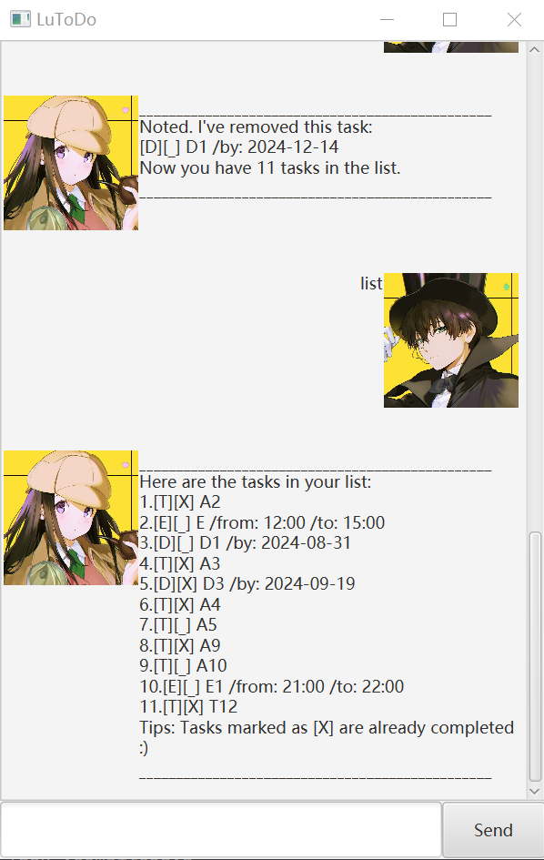

# LuToDo User Guide

[//]: # (// Update the title above to match the actual product name)

[//]: # (// Product screenshot goes here)



[//]: # (// Product intro goes here)

**LuToDo** is an improved task manager supporting
multiple actions to your tasks, including adding
tasks of 3 types, deleting tasks, marking a task as done/not done,
searching tasks by keyword, and showing the task list.

## 1. Adding and deleting Tasks

[//]: # (// Describe the action and its outcome.)

### 1.1 ToDo tasks
Use `todo` command to add a Todo task.

Example:

`todo go shopping`
```
________________________________________________
got it. I have added this task:
[T][_] go shopping
now you have 1 task in the tasklist.
________________________________________________
```

### 1.2 Deadline tasks

Use `deadline` command to add a task with a deadline.

Example:

`deadline finish quiz /by 2024-09-20`
```
________________________________________________
got it. I have added this task:
[D][_] finish quiz /by 2024-09-20
now you have 2 task in the tasklist.
________________________________________________
```

### 1.3 Event tasks

Use `event` command to add an event task.

Example:

`event meet with tp team /from 13:00 /to 16:00`
```
________________________________________________
got it. I have added this task:
[E][_] meet with tp team /from 13:00 /to 16:00
now you have 3 task in the tasklist.
________________________________________________
```

### 1.4 Delete tasks
Use `delete` command to delete a task.

Example:

`delete 1`
```
________________________________________________
Noted. I've removed this task:
[T][_] go shopping
Now you have 10 tasks in the list.
________________________________________________
```

[//]: # (// Give examples of usage)

### invalid input

`deadline invalid ddl`
```
________________________________________________
The description of the deadline task must include the ddl time, 
please try again.
Tips: use '/by' to enter the ddl date.
Supported format: yyyy-MM-dd
e.g. deadline quiz1 /by 2024-12-31
________________________________________________
```

[//]: # (// A description of the expected outcome goes here)


## Show task list

[//]: # (// Feature details)
You can type `list` to show the task list.

example:

`list`
```
________________________________________________
Here are the tasks in your list:
1.[T][X] A2
2.[E][_] E /from: 12:00 /to: 15:00
3.[D][_] D1 /by: 2024-08-31
4.[T][X] A3
5.[D][X] D3 /by: 2024-09-19
6.[T][X] A4
7.[T][_] A5
8.[T][X] A9
9.[T][_] A10
10.[E][_] E1 /from: 21:00 /to: 22:00
11.[T][X] T12
Tips: Tasks marked as [X] are already completed :)
________________________________________________
```

## Mark tasks as done / not done

[//]: # (// Feature details)
Use `mark` to mark a task as done.

Example:

`mark 2`
```
________________________________________________
Nice! I've marked this task as done:
[E][X] E /from: 12:00 /to: 15:00
________________________________________________
```

Use `unmark` to mark a task as not done.

`unmark 2`
```
________________________________________________
OK, I've marked this task as not done:
[E][_] E /from: 12:00 /to: 15:00
________________________________________________
```

## Search for tasks

[//]: # (// Feature details)
Use `search` or `find` to search a task in the task list,
whole word search and key search are all allowed.

Example:

`search A`
```
________________________________________________
Here are the matching tasks in your list:
3.[T][X] A3
5.[T][X] A4
6.[T][_] A5
7.[T][X] A9
8.[T][_] A10
________________________________________________
```

`search D3`
```
________________________________________________
Here are the matching tasks in your list:
4.[D][X] D3 /by: 2024-09-19
________________________________________________
```

## Save tasks

Tasks is automatically saved in a `tasklist.txt` file.